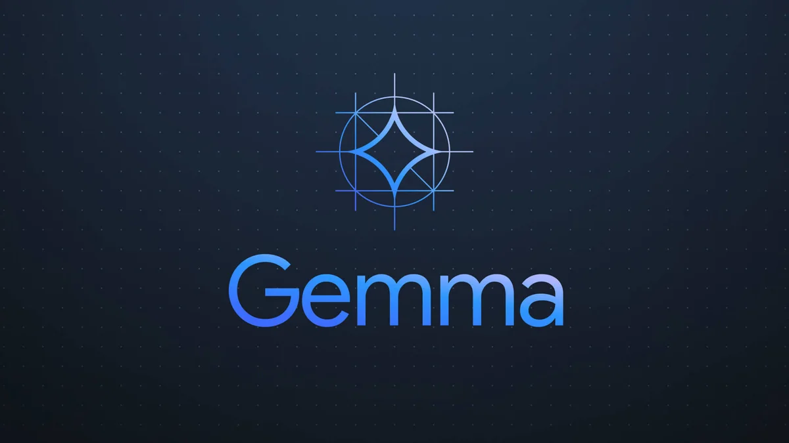
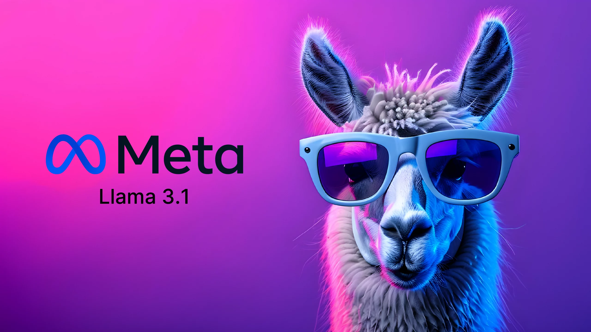
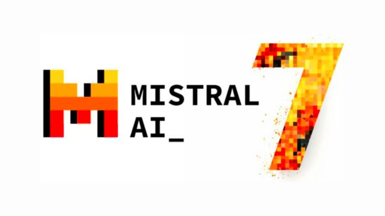
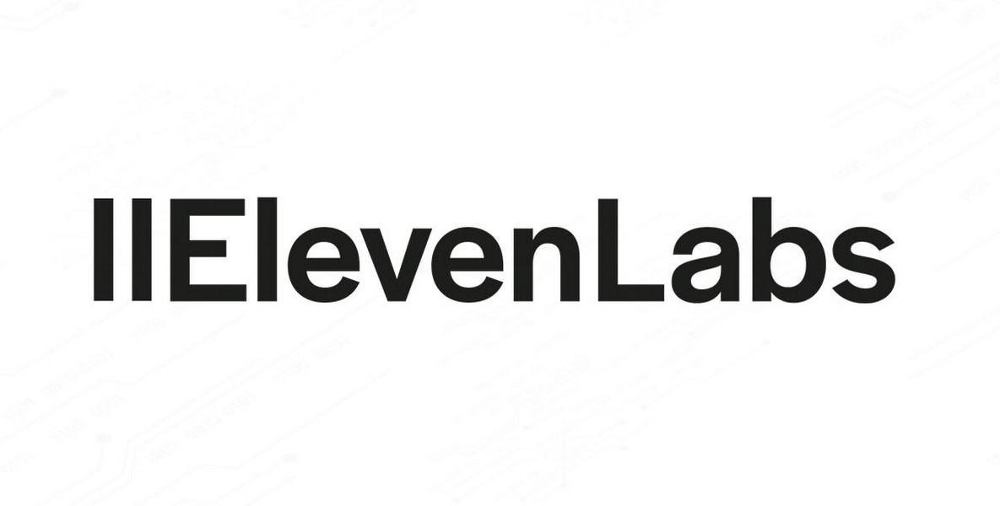

# ⚡Fast-Chat
  


### An AI chat assistant for Lightning-Fast Conversations

[](https://fast-chat.streamlit.app/)

Engage in a lightning-fast chat conversation with **Fast-Chat**, leveraging the capabilities of **GROQ**'s cutting-edge **Language Processing Unit** (**[GROQ LPU<sup>TM</sup>](https://wow.groq.com/why-groq/)**). Interact with Fast-Chat and receive immediate responses to your inquiries.

#### Powered by

[](https://ai.google.dev/gemma) [](https://llama.meta.com/) [](https://mistral.ai/news/mixtral-of-experts/) [](https://azure.microsoft.com/en-us/services/cognitive-services/computer-vision/) [](https://wow.groq.com/why-groq/) [](https://elevenlabs.io/) [](https://prodia.com/)

<div style="display: flex; justify-content: space-around;">
  
</div>
<div style="display: flex; justify-content: space-around;">  
  
  
  
</div>
<div style="display: flex; justify-content: space-around;">
  
  
  
</div>

## Key Functionalities

- [x] ⚡ **Real-Time Responses**: Experience near-instantaneous replies for a smooth and uninterrupted conversation flow.
- [x] 🔍 **Web Search Integration**: Fast-Chat seamlessly integrates web search capabilities to deliver accurate and relevant information.
- [x] 📺 **YouTube Comprehension**: Understand and interact with content from YouTube videos and shorts through Fast-Chat.
- [x] 🎙️ **Voice Recognition**: Speak directly to Fast-Chat, and it will accurately interpret and process your queries.
- [x] 🗣️ **Audio Output**: Fast-Chat responds through voice, offering an enhanced and interactive communication experience.
- [x] 🎨 **Image Generation**: Fast-Chat can generate images tailored to your needs.
- [x] 🖼️ **Multi-Modal Understanding**: Fast-Chat analyzes and comprehends visual content, such as images, for richer interactions.
- [x] 📝 **Contextual Awareness**: Retain conversation context for more relevant and insightful responses.
- [x] 🤖 **Model Selection**: Choose from a variety of models to customize your experience and meet specific requirements.
- [x] 🪛 **Parameter Tuning**: Fine-tune settings to personalize and optimize your interactions with Fast-Chat.

## Getting Started

### Prerequisites

- **`Python 3.8`** or higher
- **`git`**
- **`pipenv`** (recommended)
- [🔗GROQ API key](https://console.groq.com/keys)
- [🔗SerpAPI key](https://serpapi.com/dashboard) (optional)
- [🔗ElevenLabs API key](https://elevenlabs.io/app/speech-synthesis/text-to-speech) (optional)
- [🔗Prodia API key](https://app.prodia.com/api) (optional)

### Installation

1. Clone the repository

```sh
git clone https://github.com/sayan10rakshit/Fast-Chat.git
cd Fast-Chat
```

2. Install the required dependencies using `pipenv`/`venv`:


```sh
# Using pipenv
pipenv install
```

**OR**
  


```sh
# Using venv
python3 -m venv .env_for_fast_chat
source .env_for_fast_chat/bin/activate
pip install -r requirements.txt
```

🚨 **NOTE**: If you are facing any error/s try using `python` instead of `python3` in the above commands  

<details>
<summary></summary>

```powershell
# Using venv
python3 -m venv .env_for_fast_chat
.env_for_fast_chat\Scripts\Activate
pip install -r requirements.txt
```

  🚨 **NOTE**: If you are facing any error/s try using `python` instead of `python3` in the above commands  
</details>

## Usage

- Launch with Streamlit:
  - With `pipenv`

    

    ```sh
    # You can run without activating the virtual environment
    pipenv run streamlit run app.py
    ```

    **OR**

    ```sh
    # Activate the virtual environment
    pipenv shell
    streamlit run app.py
    ```

    ```sh
    # Deactivate the virtual environment after using Fast-Chat
    deactivate
    ```

  - With `venv`
  
      

      ```sh
      # Activate the virtual environment
      source .env_for_fast_chat/bin/activate
      streamlit run app.py
      ```

      ```sh
      # Deactivate the virtual environment after using Fast-Chat
      deactivate
      ```

      <details>
      <summary></summary>

      ```powershell
      # Activate the virtual environment
      .env_for_fast_chat\Scripts\Activate
      streamlit run app.py
      ```

      ```powershell
      # Deactivate the virtual environment after using Fast-Chat
      deactivate
      ```

      </details>

- When the app is running, use Fast-Chat in your browser at `http://localhost:8501`

## Coming Soon

- [ ] **Agentic Search**: Gives more comprehensive search results to ambiguous queries.
- [ ] **Map Integration**: Integrate maps to provide location-based information.
